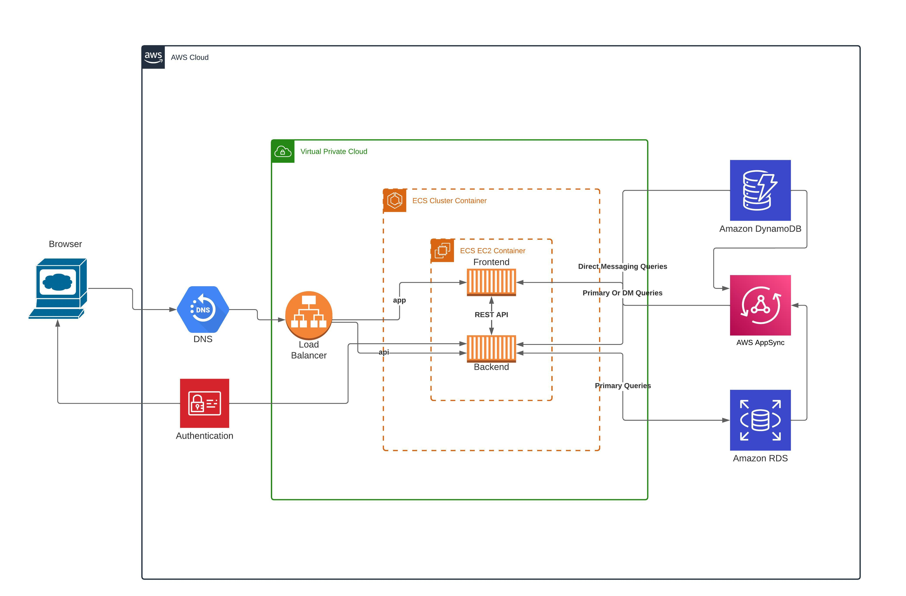

# Week 0 — Billing and Architecture

Hi there 👋, Atharva Malji here and this is my week 0 homework. I was caught up in my classes and project work so finally getting a start on this one

I had previously used lucidcharts for my personal and university projects but today I was really able to see that it offers much more things than I initally used it for.

Anyways here's the diagram that I created. It's quite similar to andrew's but I was able to learn a lot never the less.

also here's the link to it if anyone want's to tak a look

👉 [Lucidchart Architecture Diagram Link](https://lucid.app/lucidchart/b99a809a-9063-4158-9385-dc0e94657291/edit?view_items=xYnyya4qf.yo%2Cgcoy9GfG1vsw%2CQ.nyXW2ZQhxv%2CWWny1MuYpTdD%2CIPnys_RTHeKN%2C4coy~MU0PyFn%2CB8nyxTAUyux2%2CbSnymdFqCfKQ%2C9XnybozKvWDp%2C1Tny5igsotZL%2CyPnybWKC3B9U%2CtfoyC58suAjs%2CFPnyPCFa.nQV%2Cy_nynf8f-Cc4%2C--ny7D3ATmLL%2C..ny~VeFjUme%2Cy0nyPj5PPcxG%2CSeoy7~iH85-w%2CRdoyS7eW5CP~%2CX-ny4_6O5VJx%2CpcoyucEbVCu7%2CVdoyFtYxEDis%2C4goyfEkEv3ax%2CHZny158tehDI%2Cj~nyfamQKmd0%2CseoyWs928mMp&invitationId=inv_afd67b7b-c045-4316-96d9-1a1f5d0348d3)