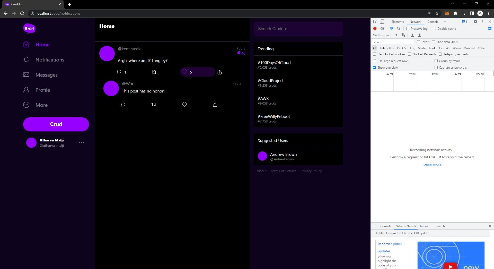

# Week 1 — App Containerization

In this week I cloned the repository and created containers for both the frontend and backend. following is the frontend outcome which shows that I was ablue to successfully run the frontend and backend.

Also if you see closely, you can see that I was able to create the notification component and the backend for it. (The screenshot shows the notification page.)

